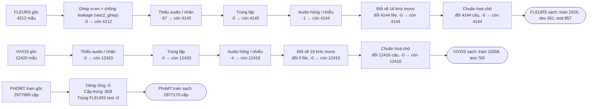

# Flowchart làm sạch (slide 4)

Dán khối dưới vào https://mermaid.live để xuất ảnh PNG/SVG.

```mermaid
flowchart LR
  fleurs0["FLEURS gốc<br/>4212 mẫu"]
  fleurs0 --> fleurs1["Ghép vi-en + chống leakage (viec2_ghep)<br/>-0 → còn 4212"]
  fleurs1 --> fleurs2["Thiếu audio / nhãn<br/>-67 → còn 4145"]
  fleurs2 --> fleurs3["Trùng lặp<br/>-0 → còn 4145"]
  fleurs3 --> fleurs4["Audio hỏng / nhiễu<br/>-1 → còn 4144"]
  fleurs4 --> fleurs5["Đổi về 16 kHz mono<br/>đổi 4144 file, -0 → còn 4144"]
  fleurs5 --> fleurs6["Chuẩn hoá chữ<br/>đổi 4144 câu, -0 → còn 4144"]
  fleurs6 --> fleursX(["FLEURS sạch: train 2926, dev 361, test 857"])
  vivos0["VIVOS gốc<br/>12420 mẫu"]
  vivos0 --> vivos1["Thiếu audio / nhãn<br/>-0 → còn 12420"]
  vivos1 --> vivos2["Trùng lặp<br/>-0 → còn 12420"]
  vivos2 --> vivos3["Audio hỏng / nhiễu<br/>-4 → còn 12416"]
  vivos3 --> vivos4["Đổi về 16 kHz mono<br/>đổi 0 file, -0 → còn 12416"]
  vivos4 --> vivos5["Chuẩn hoá chữ<br/>đổi 12416 câu, -0 → còn 12416"]
  vivos5 --> vivosX(["VIVOS sạch: train 11656, test 760"])
  phomt0["PHOMT train gốc<br/>2977999 cặp"] --> phomt1["Dòng rỗng -0<br/>Cặp trùng -829<br/>Trùng FLEURS test -0"] --> phomtX(["PhoMT train sạch: 2977170 cặp"])
```
